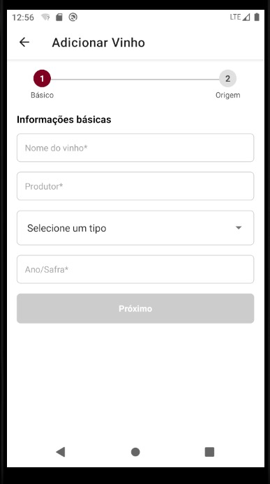
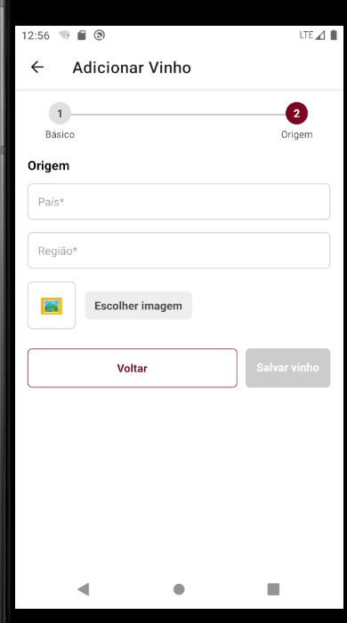
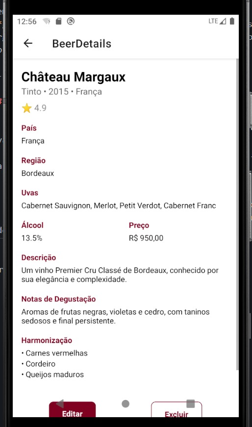

# 🍷 App-Vinho — Minha Adega Virtual

Bem-vindo ao **App-Vinho**, um aplicativo pessoal para **gerenciar sua coleção de vinhos**. Adicione, visualize e organize rótulos com praticidade e elegância, tudo direto do seu celular.

---

## ✨ Funcionalidades

- 📋 Cadastro completo de vinhos: nome, tipo, safra, país, uvas, notas
- 🌍 Tela de detalhes com informações como álcool, preço e harmonização
- ⭐ Favoritos e avaliações por estrela
- 🔄 Interface moderna com navegação por etapas
- 💾 Armazenamento local com AsyncStorage (por enquanto)
- 📱 Design inspirado em experiências reais de usuários de adega

---

## 🛠️ Tecnologias utilizadas

- [React Native](https://reactnative.dev/)
- [Expo](https://expo.dev/)
- [TypeScript](https://www.typescriptlang.org/)
- [AsyncStorage](https://react-native-async-storage.github.io/async-storage/)
- [React Navigation](https://reactnavigation.org/)
- [React Native Picker](https://github.com/react-native-picker/picker)

---

## 📸 Screenshots

| Tela Inicial | Etapa 1 | Etapa 2 | Detalhes |
|--------------|---------|---------|----------|
|  |  |  |  |


---

## 🚀 Executando localmente

1. Clone o repositório:

```bash
git clone https://github.com/luizGervazio/App-Vinho.git
cd App-Vinho
Instale as dependências:

bash
Copiar
Editar
npm install
Inicie o app com o Expo:

bash
Copiar
Editar
npx expo start
📌 Próximos passos
Integração com backend (NestJS + Prisma + PostgreSQL)

Sincronização multi-dispositivo

Galeria de rótulos e leitura via OCR

Backup na nuvem (Firebase ou Supabase)

📄 Licença
Este projeto é de uso pessoal e acadêmico. Sinta-se livre para clonar e adaptar conforme necessário.

Feito com ❤️ por @luizGervazio

yaml
Copiar
Editar

---

## ✅ Próximo passo

1. Crie um arquivo chamado `README.md` na raiz do projeto.
2. Cole o conteúdo acima.
3. Adicione ao Git e envie:

```bash
git add README.md
git commit -m "Adiciona README do projeto App-Vinho 🍷"
git push origin main